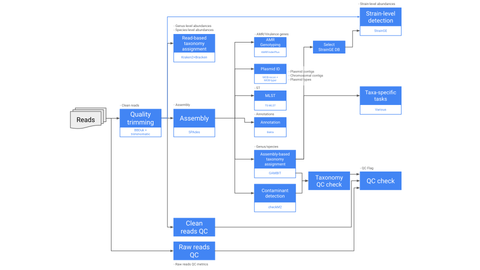

# GEMSTONE_Isolates_Illumina_PE

 `v1.0.0` 

This workflow processes paired-end Illumina reads from bacterial isolates. It performs QA and QC, flagging low quality and contaminated samples. Samples for which reads fail QC are not subject to further analysis. Performs *de novo* assembly with SPAdes and refines it with Pilon. Finds AMR, virulence, and stress genes with AMRFinderPlus, identifies and types plasmid contigs with MOB-recon, types sequences with TS-MLST, annotates them with Bakta, and infers taxonomy with GAMBIT. Also performs taxa-specific analysis - please refer to [TheiaProk documentation](https://theiagen.notion.site/TheiaProk-Workflow-Series-1296f3df6a7c41c7937053a03f664a5a) for those tasks. Optionally, it estimates taxa abundances with Kraken2 and Bracken and does strain-level identification with StrainGE (based on the GAMBIT predicted taxon).

This workflow was based on the [PHB v1.0.0 TheiaProk workflow](https://theiagen.notion.site/TheiaProk-Workflow-Series-1296f3df6a7c41c7937053a03f664a5a) from Theiagen.

## Inputs

Click to open or hide

### Workflow options

#### call_kmerfinder
`Boolean` `Optional` `Default = false` If `true`, predicts species based on k-mer similarity (with k = 16) between the assebly and genomes in a [Theiagen bacterial database](https://theiagen.notion.site/TheiaProk-Workflow-Series-1296f3df6a7c41c7937053a03f664a5a?p=27c5fc0f5dc94df9a01523d5da1dc22b&pm=s).

#### call_kraken
`Boolean` `Optional` `Default = false` If `true`, identifies taxa and estimates their abundance with Kraken2/Bracken.

#### call_strainge
`Boolean` `Optional` `Default = false` If `true`, performs strain-level detection with StrainGE.

#### expected_taxon
`String` `Optional` If set, overrides the GAMBIT predicted species when setting a species in AMRFinderPlus and when comparing QC metrics agains the thresholds defined in `qc_check_table`. Useful for when GAMBIT predictions are incorrect. If not set, uses GAMBIT the prediction.

### Sample data
    
#### read1_raw
`File` `Required` FASTQ file with forward raw reads. Must be Illumina paired-end.

#### read2_raw
`File` `Required` FASTQ file with reverse raw reads. Must be Illumina paired-end.

#### samplename 
`String` `Required` Name or ID of the sample.

#### lab_determined_genus 
`String` `Optional` Genus or species name, as determined in the lab. Must be written in full, with whitespaces (e.g., *Escherichia coli* and not *E. coli* nor *Escherichia_coli*). It is compared against the GAMBIT predicted taxonomy to derive a *taxonomy QC flag*, corresponding to the `qc_taxonomy_check` output. If the lab predicted genus mathces the GAMBIT prediction, then `qc_taxonomy_check` is set to `PASS`; otherwise, it is set to `ALERT`.

### Global QA/QC

#### contamination_threshold 
`Float` `Optional` `Default = 2` Maximum contamination as a percentage (as determined by checkM2) allowed for a sample to pass taxonomy QC. The default of 2 means that the contamination threshold is 2%.

#### qc_check_table
`File` `Optional` User-defined, taxa-specific, thresholds for QC metrics as a TSV file. If all QC metrics meet the threshold, the `qc_check` output variable will read `QC_PASS`. Otherwise, the output will read `QC_NA` if the task could not proceed or `QC_ALERT` followed by a string indicating what metric failed. Each row in the table should be a species or genus, written in full, with underscores instead of whitespaces (matching the format from GAMBIT). Column names should be *taxon*, followed by the QC metric name. The sample taxa is taken from the `gambit_predicted_taxon` value inferred by GAMBIT or from a user-defined `expected_taxon`. Example of a `qc_check_table`:

<table><tbody><tr><th scope="col" style="font-weight: 500; border: 1px solid rgb(233, 233, 231); position: relative; vertical-align: top; text-align: start; min-width: 120px; max-width: 240px; min-height: 32px;">

taxon

</th><th scope="col" style="font-weight: 500; border: 1px solid rgb(233, 233, 231); position: relative; vertical-align: top; text-align: start; min-width: 120px; max-width: 240px; min-height: 32px;">

est_coverage_raw

</th><th scope="col" style="font-weight: 500; border: 1px solid rgb(233, 233, 231); position: relative; vertical-align: top; text-align: start; min-width: 120px; max-width: 240px; min-height: 32px;">

est_coverage_clean

</th><th scope="col" style="font-weight: 500; border: 1px solid rgb(233, 233, 231); position: relative; vertical-align: top; text-align: start; min-width: 170px; max-width: 170px; min-height: 32px;">

assembly_length_min

</th><th scope="col" style="font-weight: 500; border: 1px solid rgb(233, 233, 231); position: relative; vertical-align: top; text-align: start; min-width: 166px; max-width: 166px; min-height: 32px;">

assembly_length_max

</th></tr><tr><td style="color: inherit; fill: inherit; border: 1px solid rgb(233, 233, 231); position: relative; vertical-align: top; text-align: start; min-width: 120px; max-width: 240px; min-height: 32px;">

Listeria_monocytogenes

</td><td style="color: inherit; fill: inherit; border: 1px solid rgb(233, 233, 231); position: relative; vertical-align: top; text-align: start; min-width: 120px; max-width: 240px; min-height: 32px;">

20

</td><td style="color: inherit; fill: inherit; border: 1px solid rgb(233, 233, 231); position: relative; vertical-align: top; text-align: start; min-width: 120px; max-width: 240px; min-height: 32px;">

</td><td style="color: inherit; fill: inherit; border: 1px solid rgb(233, 233, 231); position: relative; vertical-align: top; text-align: start; min-width: 170px; max-width: 170px; min-height: 32px;">

2800000

</td><td style="color: inherit; fill: inherit; border: 1px solid rgb(233, 233, 231); position: relative; vertical-align: top; text-align: start; min-width: 166px; max-width: 166px; min-height: 32px;">

3200000

</td></tr><tr><td style="color: inherit; fill: inherit; border: 1px solid rgb(233, 233, 231); position: relative; vertical-align: top; text-align: start; min-width: 120px; max-width: 240px; min-height: 32px;">

Escherichia_coli

</td><td style="color: inherit; fill: inherit; border: 1px solid rgb(233, 233, 231); position: relative; vertical-align: top; text-align: start; min-width: 120px; max-width: 240px; min-height: 32px;">

40

</td><td style="color: inherit; fill: inherit; border: 1px solid rgb(233, 233, 231); position: relative; vertical-align: top; text-align: start; min-width: 120px; max-width: 240px; min-height: 32px;">

</td><td style="color: inherit; fill: inherit; border: 1px solid rgb(233, 233, 231); position: relative; vertical-align: top; text-align: start; min-width: 170px; max-width: 170px; min-height: 32px;">

4900000

</td><td style="color: inherit; fill: inherit; border: 1px solid rgb(233, 233, 231); position: relative; vertical-align: top; text-align: start; min-width: 166px; max-width: 166px; min-height: 32px;">

6000000

</td></tr><tr><td style="color: inherit; fill: inherit; border: 1px solid rgb(233, 233, 231); position: relative; vertical-align: top; text-align: start; min-width: 120px; max-width: 240px; min-height: 32px;">

Shigella

</td><td style="color: inherit; fill: inherit; border: 1px solid rgb(233, 233, 231); position: relative; vertical-align: top; text-align: start; min-width: 120px; max-width: 240px; min-height: 32px;">

40

</td><td style="color: inherit; fill: inherit; border: 1px solid rgb(233, 233, 231); position: relative; vertical-align: top; text-align: start; min-width: 120px; max-width: 240px; min-height: 32px;">

</td><td style="color: inherit; fill: inherit; border: 1px solid rgb(233, 233, 231); position: relative; vertical-align: top; text-align: start; min-width: 170px; max-width: 170px; min-height: 32px;">

4200000

</td><td style="color: inherit; fill: inherit; border: 1px solid rgb(233, 233, 231); position: relative; vertical-align: top; text-align: start; min-width: 166px; max-width: 166px; min-height: 32px;">

4900000

</td></tr><tr><td style="color: inherit; fill: inherit; border: 1px solid rgb(233, 233, 231); position: relative; vertical-align: top; text-align: start; min-width: 120px; max-width: 240px; min-height: 32px;">

Salmonella

</td><td style="color: inherit; fill: inherit; border: 1px solid rgb(233, 233, 231); position: relative; vertical-align: top; text-align: start; min-width: 120px; max-width: 240px; min-height: 32px;">

30

</td><td style="color: inherit; fill: inherit; border: 1px solid rgb(233, 233, 231); position: relative; vertical-align: top; text-align: start; min-width: 120px; max-width: 240px; min-height: 32px;">

</td><td style="color: inherit; fill: inherit; border: 1px solid rgb(233, 233, 231); position: relative; vertical-align: top; text-align: start; min-width: 170px; max-width: 170px; min-height: 32px;">

4400000

</td><td style="color: inherit; fill: inherit; border: 1px solid rgb(233, 233, 231); position: relative; vertical-align: top; text-align: start; min-width: 166px; max-width: 166px; min-height: 32px;">

5700000

</td></tr><tr><td style="color: inherit; fill: inherit; border: 1px solid rgb(233, 233, 231); position: relative; vertical-align: top; text-align: start; min-width: 120px; max-width: 240px; min-height: 32px;">

Campylobacter

</td><td style="color: inherit; fill: inherit; border: 1px solid rgb(233, 233, 231); position: relative; vertical-align: top; text-align: start; min-width: 120px; max-width: 240px; min-height: 32px;">

20

</td><td style="color: inherit; fill: inherit; border: 1px solid rgb(233, 233, 231); position: relative; vertical-align: top; text-align: start; min-width: 120px; max-width: 240px; min-height: 32px;">

</td><td style="color: inherit; fill: inherit; border: 1px solid rgb(233, 233, 231); position: relative; vertical-align: top; text-align: start; min-width: 170px; max-width: 170px; min-height: 32px;">

1400000

</td><td style="color: inherit; fill: inherit; border: 1px solid rgb(233, 233, 231); position: relative; vertical-align: top; text-align: start; min-width: 166px; max-width: 166px; min-height: 32px;">

2200000

</td></tr><tr><td style="color: inherit; fill: inherit; border: 1px solid rgb(233, 233, 231); position: relative; vertical-align: top; text-align: start; min-width: 120px; max-width: 240px; min-height: 32px;">

Vibrio_cholerae

</td><td style="color: inherit; fill: inherit; border: 1px solid rgb(233, 233, 231); position: relative; vertical-align: top; text-align: start; min-width: 120px; max-width: 240px; min-height: 32px;">

40

</td><td style="color: inherit; fill: inherit; border: 1px solid rgb(233, 233, 231); position: relative; vertical-align: top; text-align: start; min-width: 120px; max-width: 240px; min-height: 32px;">

</td><td style="color: inherit; fill: inherit; border: 1px solid rgb(233, 233, 231); position: relative; vertical-align: top; text-align: start; min-width: 170px; max-width: 170px; min-height: 32px;">

3800000

</td><td style="color: inherit; fill: inherit; border: 1px solid rgb(233, 233, 231); position: relative; vertical-align: top; text-align: start; min-width: 166px; max-width: 166px; min-height: 32px;">

4300000

</td></tr><tr><td style="color: inherit; fill: inherit; border: 1px solid rgb(233, 233, 231); position: relative; vertical-align: top; text-align: start; min-width: 120px; max-width: 240px; min-height: 32px;">

Vibrio_parahaemolyticus

</td><td style="color: inherit; fill: inherit; border: 1px solid rgb(233, 233, 231); position: relative; vertical-align: top; text-align: start; min-width: 120px; max-width: 240px; min-height: 32px;">

40

</td><td style="color: inherit; fill: inherit; border: 1px solid rgb(233, 233, 231); position: relative; vertical-align: top; text-align: start; min-width: 120px; max-width: 240px; min-height: 32px;">

</td><td style="color: inherit; fill: inherit; border: 1px solid rgb(233, 233, 231); position: relative; vertical-align: top; text-align: start; min-width: 170px; max-width: 170px; min-height: 32px;">

4900000

</td><td style="color: inherit; fill: inherit; border: 1px solid rgb(233, 233, 231); position: relative; vertical-align: top; text-align: start; min-width: 166px; max-width: 166px; min-height: 32px;">

5500000

</td></tr><tr><td style="color: inherit; fill: inherit; border: 1px solid rgb(233, 233, 231); position: relative; vertical-align: top; text-align: start; min-width: 120px; max-width: 240px; min-height: 32px;">

Vibrio_vulnificus

</td><td style="color: inherit; fill: inherit; border: 1px solid rgb(233, 233, 231); position: relative; vertical-align: top; text-align: start; min-width: 120px; max-width: 240px; min-height: 32px;">

40

</td><td style="color: inherit; fill: inherit; border: 1px solid rgb(233, 233, 231); position: relative; vertical-align: top; text-align: start; min-width: 120px; max-width: 240px; min-height: 32px;">

</td><td style="color: inherit; fill: inherit; border: 1px solid rgb(233, 233, 231); position: relative; vertical-align: top; text-align: start; min-width: 170px; max-width: 170px; min-height: 32px;">

4700000

</td><td style="color: inherit; fill: inherit; border: 1px solid rgb(233, 233, 231); position: relative; vertical-align: top; text-align: start; min-width: 166px; max-width: 166px; min-height: 32px;">

5300000

</td></tr></tbody></table>

### Read QA/QC

#### genome_size
`Int` `Optional` Expected genome size in bp. Used during read and assembly QC. If not provided, the workflow uses the genome length estimated by QUAST for assembly QC.

#### skip_screen
`Int` `Optional` `Default = false` If `true`, skips read QA/QC.

#### min_reads
`Int` `Optional` `Default = 7472` Minimum number of reads (raw and clean) needed to pass QC.

#### min_basepairs
`Int` `Optional` `Default = 2241820` Minimum number of total bp in reads (raw and clean) needed to pass QC.

#### min_genome_size
`Int` `Optional` `Default = 7472` Minimum estimated genome size in bp needed to pass QC (both for raw and clean reads).

#### max_genome_size
`Int` `Optional` `Default = 18040666` Maximum estimated genome size in bp needed to pass QC (both for raw and clean reads).

#### min_coverage
`Int` `Optional` `Default = 10` Minimum estimated genome coverage needed to pass QC (both for raw and clean reads).

#### min_proportion
`Int` `Optional` `Default = 40` The proportion of basepairs reads in the forward and reverse read files: A sample will fail the read screening if fewer than these proportion of basepairs are in either the forward or reverse reads files.

### Read trimming

#### trim_minlen
`Int` `Optional` `Default = 75` Minimum read length in bp required after trimming for it to be included in downstream analyses.

#### trim_quality_trim_score
`Int` `Optional` `Default = 20` Average quality of bases in a sliding window needed for those bases to be kept.

#### trim_window_size
`Int` `Optional` `Default = 10` Length in bp of the window used for trimming.

### Taxon identification with Kracken2/Bracken

#### kraken2_db
`File` `Optional` Compressed Kraken2/Bracken database as a tar archive. Required if `call_kraken` is `true`. Please make sure that the archive contains all the files needed to run Bracken (refer to the [Bracken docs](https://github.com/jenniferlu717/Bracken)).

#### bracken_read_len
`Int` `Optional` `Default = 150` Input read length.

#### bracken_classification_level
`String` `Optional` `Default = "G"` Taxonomic level for Bracken abundance estimation. Defaults to genus level (G).  Other possible options are K (kingdom level), P (phylum), C (class), O (order), F (family), and S (species)

#### kraken2_disk_size
`Int` `Optional` `Default = 256` Disk size in Gb for the Kraken2/Bracken task.

#### kraken2_cpu
`Int` `Optional` `Default = 4` Number of CPUs used in the Kraken2/Bracken task task.

#### kraken2_mem
`Int` `Optional` `Default = 32` RAM in Gb for the Kraken2/Bracken task task.

### Strain-level detection with StrainGE

#### strainge_db_config
`File` `Required` TSV configuration file for StrainGE databases. It should be a table with two columns: one with the database genus name (e.g., *Escherichia* or *Proteus*), and another with the path to the tar archive with the StrainGE database for that genus. An example of this table is:

<table>
    <tr> 
        <th> Escherichia </th>
        <td> gs://fc-secure-uuid/databases/strainge/escherichia_shigella.tar.gz </td> 
    </tr>
    <tr> 
        <th> Shigella </th>
        <td> gs://fc-secure-uuid/databases/strainge/escherichia_shigella.tar.gz </td> 
    </tr>
    <tr> 
        <th> Pseudomonas </th>
        <td> gs://fc-secure-uuid/databases/strainge/pseudomonas.tar.gz </td> 
    </tr>	
    <tr> 
        <th> Staphylococcus </th>
        <td> gs://fc-secure-uuid/databases/strainge/staphylococcus.tar.gz </td> 
    </tr>
    <tr> 
        <th> Proteus </th>
        <td> gs://fc-secure-uuid/databases/strainge/proteus.tar.gz </td> 
    </tr>	
    <tr> 
        <th> Klebsiella </th>
        <td> gs://fc-secure-uuid/databases/strainge/klebsiella.tar.gz </td> 
    </tr>	
    <tr> 
        <th> Acinetobacter </th>
        <td> gs://fc-secure-uuid/databases/strainge/acinetobacter.tar.gz </td> 
    </tr>	
    <tr> 
        <th> Enterobacter </th>
        <td> gs://fc-secure-uuid/databases/strainge/enterobacter.tar.gz </td> 
    </tr>	
    <tr> 
        <th> Enterococcus </th>
        <td> gs://fc-secure-uuid/databases/strainge/enterococcus.tar.gz </td> 
    </tr>	
</table>

#### strainge_max_strains
`Int` `Optional` `Default = 5` Maximum number of strains searched by StrainGST.

#### strainge_db_kmer_size
`Int` `Optional` `Default = 23` K-mer sized used when creating the StrainGST databases.

## Outputs

Click to open or hide

#### theiameta_illumina_pe_version
`String` Version of the TheiaProk workflow used.

#### analysis_date
`String` Analysis date.

### Global QA/QC

#### raw_read_screen
`String` "PASS" or "FAIL" result from raw read screening. If the result is "FAIL", the flag is accompanied by the reason for failure.

#### clean_read_screen
`String` `Optional` "PASS" or "FAIL" result from clean read screening. If the result is "FAIL", the flag is accompanied by the reason for failure. If the raw reads did not pass QC, `clean_read_screen` will not be returned.

### Read QA/QC

#### num_reads_raw1
`Int` `Optional` Number of reads in `read1`.

#### num_reads_raw2
`Int` `Optional` Number of reads in `read2`.

#### num_reads_raw_pairs
`Int` `Optional` Number of pairs of reads in `read1` and `read2` (raw reads).

#### fastq_scan_version
`String` `Optional` Version of fastq_scan used.

#### num_reads_clean1
`Int` `Optional` Number of reads after QC in `read1_clean`.

#### num_reads_clean2
`Int` `Optional` Number of reads after QC in `read2_clean`.

#### num_reads_clean_pairs
`Int` `Optional` Number of read pairs after QC in `read1_clean` and `read2_clean` (clean reads).

#### trimmomatic_version
`String` `Optional` Version of trimmomatic used.

#### read1_clean
`File` `Optional` FASTQ file with forward cleaned reads, after QC and de-hosting.

#### read2_clean
`File` `Optional` FASTQ file with reverse cleaned reads, after QC and de-hosting.

#### bbduk_docker
`String` `Optional` Name of the BBDuk Docker image used.

#### r1_mean_q_raw
`Float` `Optional` Mean quality score of forward raw reads.

#### r2_mean_q_raw
`Float` `Optional` Mean quality score of reverse raw reads.

#### combined_mean_q_raw
`Float` `Optional` Mean quality score of forward and reverse raw reads.

#### combined_mean_q_clean
`Float` `Optional` Mean quality score of forward and reverse clean reads.

#### r1_mean_readlength_raw
`Float` `Optional` Mean read length in bp of forward raw reads.

#### r2_mean_readlength_raw
`Float` `Optional` Mean read length in bp of reverse raw reads.

#### combined_mean_readlength_raw
`Float` `Optional` Mean read length in bp of forward and reverse raw reads.

#### combined_mean_readlength_clean
`Float` `Optional` Mean read length in bp of forward and reverse clean reads.

## Authors

__Marco Teixeira__

 mcarvalh@broadinstitute.org 

__Colin Worby__

 cworby@broadinstitute.org 

