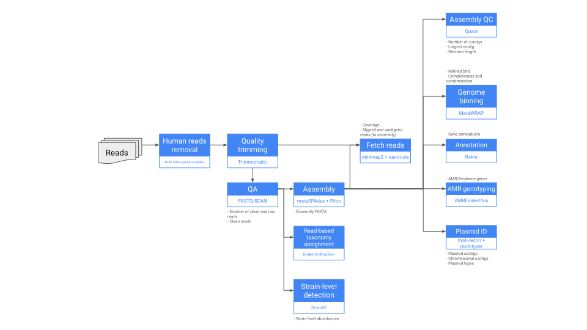

# GEMSTONE_Plate_Swipes_Illumina_PE

This workflow processes paired-end Illumina reads from plate swipes/plate bacterial metagenomes. It could also be used for broader bacterial metagenomic analysis. It removes human reads, performs QA and QC, and metagenomic assembly. Furthermore, it estimates taxa abundances with Kraken2 and Bracken, does strain-level identification with StrainGE, bins MAGs, performs AMR genotyping, and identifies plasmid contigs.

This workflow was based on the [PHB v1.0.0 TheiaMeta workflow](https://theiagen.notion.site/TheiaMeta-7e73c010559148b380144d7c3b3ec4e6) from Theiagen.

## Inputs

    
### read1 
`File` `Required`

First FASTQ file with raw reads.

### read2
`File` `Required`

Second FASTQ file with raw reads.

### samplename 
`String` `Required`

Name or ID of the sample.

### lab_determined_genus 
`String` `Required`

Genus or species name, as determined in the lab or by GAMBIT. Must be written in full, with whitespaces (e.g., *Escherichia coli* and not *E. coli* nor *Escherichia_coli*). Used to select a StrainGE reference database by matching the genus passed in this parameter with those in each database. Multiple genera are supported through a "/" separator, such as "Escherichia/Klebsiella" - this will call StrainGE twice, once using an Escherichia database, and once with a Klebsiella database.

### output_aditional_files
`Boolean` `Optional` `Default = false`

If `true`, aligns reads to the assembly, computes coverage, and retrieves aligned and unaligned reads.

### reference
`File` `Optional`

Reference file for consensus calling, in FASTA format. If provided, performs consensus assembly and calling.

### call_strainge
`Boolean` `Optional` `Default = false`

If `true`, performs strain-level detection with StrainGE.

### strainge_db_config
`File` `Required`

TSV configuration file for StrainGE databases. It should be a table with two columns: one with the database genus name (e.g., *Escherichia* or *Proteus*), and another with the path to the tar archive with the StrainGE database for that genus. An example of this table is:

<table>
    <tr> 
        <th> Escherichia </th>
        <td> gs://fc-secure-uuid/databases/strainge/escherichia_shigella.tar.gz </td> 
    </tr>
    <tr> 
        <th> Shigella </th>
        <td> gs://fc-secure-uuid/databases/strainge/escherichia_shigella.tar.gz </td> 
    </tr>
    <tr> 
        <th> Pseudomonas </th>
        <td> gs://fc-secure-uuid/databases/strainge/pseudomonas.tar.gz </td> 
    </tr>	
    <tr> 
        <th> Staphylococcus </th>
        <td> gs://fc-secure-uuid/databases/strainge/staphylococcus.tar.gz </td> 
    </tr>
    <tr> 
        <th> Proteus </th>
        <td> gs://fc-secure-uuid/databases/strainge/proteus.tar.gz </td> 
    </tr>	
    <tr> 
        <th> Klebsiella </th>
        <td> gs://fc-secure-uuid/databases/strainge/klebsiella.tar.gz </td> 
    </tr>	
    <tr> 
        <th> Acinetobacter </th>
        <td> gs://fc-secure-uuid/databases/strainge/acinetobacter.tar.gz </td> 
    </tr>	
    <tr> 
        <th> Enterobacter </th>
        <td> gs://fc-secure-uuid/databases/strainge/enterobacter.tar.gz </td> 
    </tr>	
    <tr> 
        <th> Enterococcus </th>
        <td> gs://fc-secure-uuid/databases/strainge/enterococcus.tar.gz </td> 
    </tr>	
</table>

### strainge_max_strains
`Int` `Optional` `Default = 5`

Maximum number of strains searched by StrainGST.

### strainge_disk_size
`Int` `Optional` `Default = 100`

Disk size in Gb for the StrainGE task.

### strainge_cpus
`Int` `Optional` `Default = 4`

Number of CPUs used in the StrainGE task.

### strainge_memory
`Int` `Optional` `Default = 128`

RAM in Gb for the StrainGE task.

### strainge_db_kmer_size
`Int` `Optional` `Default = 23`

K-mer sized used when creating the StrainGST databases.

### call_kraken
`Boolean` `Optional` `Default = false`

If `true`, identifies taxa and estimates their abundance with Kraken2/Bracken.

### kraken2_db
`File` `Optional`

Compressed Kraken2/Bracken database as a tar archive. Required if `call_kraken` is `true`. Please make sure that the archive contains all the files needed to run Bracken (refer to the [Bracken docs](https://github.com/jenniferlu717/Bracken)).

### bracken_read_len
`Int` `Optional` `Default = 150`

Input read length.

### bracken_classification_level
`String` `Optional` `Default = "G""`

Taxonomic level for Bracken abundance estimation. Defaults to genus level (G).  Other possible options are K (kingdom level), P (phylum), C (class), O (order), F (family), and S (species)

### kraken2_disk_size
`Int` `Optional` `Default = 256`

Disk size in Gb for the Kraken2/Bracken task.

### kraken2_cpu
`Int` `Optional` `Default = 4`

Number of CPUs used in the Kraken2/Bracken task task.

### kraken2_mem
`Int` `Optional` `Default = 32`

RAM in Gb for the Kraken2/Bracken task task.

### call_metawrap
`Boolean` `Optional` `Default = false`

If `true`, performs genome binning and refinement of bins with metaWRAP.

### metawrap_checkm_db
`File` `Optional`

Compressed checkM database as a tar archive to be used in metaWRAP. Required if `call_metawrap` is `true`.

### metawrap_completion
`Int` `Optional` `Default = 80`

Minimum completion of MAG bins, as determined by checkM, in percentage (i.e., a value of `80` means only bins with comlpetion greater or equal to 80% will be returned).

### metawrap_contamination
`Int` `Optional` `Default = 10`

Maximum contamination of MAG bins, as determined by checkM, in percentage (i.e., a value of `10` means only bins with contamination less than or equal to 10% will be returned).

### metawrap_min_contig_length
`Int` `Optional` `Default = 1000`

Minimum length in bp of contigs included in the MAG bins returned by metaWRAP.

### binning_flags
`String` `Optional` `Default = "--metabat2 --maxbin2 --concoct"`

Contig binning tools used in metaWRAP, as flags. These flags are used in the metaWRAP *binning* command.

## Outputs

### theiameta_illumina_pe_version
`String`

Version of the TheiaMeta workflow used.

### analysis_date
`String`

Analysis date.

### kraken2_version
`String` `Optional`
 
Kraken2 version used.

### kraken2_docker
`String` `Optional`

Kraken2 and Bracken Docker image name used.

### kraken2_report
`File` `Optional`

Kraken2 report with taxa classifications.

### kraken2_percent_human
`File` `Optional`

Percentage of human-classified reads in the sample as determined by Kracken2.

### bracken_report
`File` `Optional`

Bracken report with estimated abundances per taxon.

### bracken_version
`String` `Optional`
 
Bracken version used.

